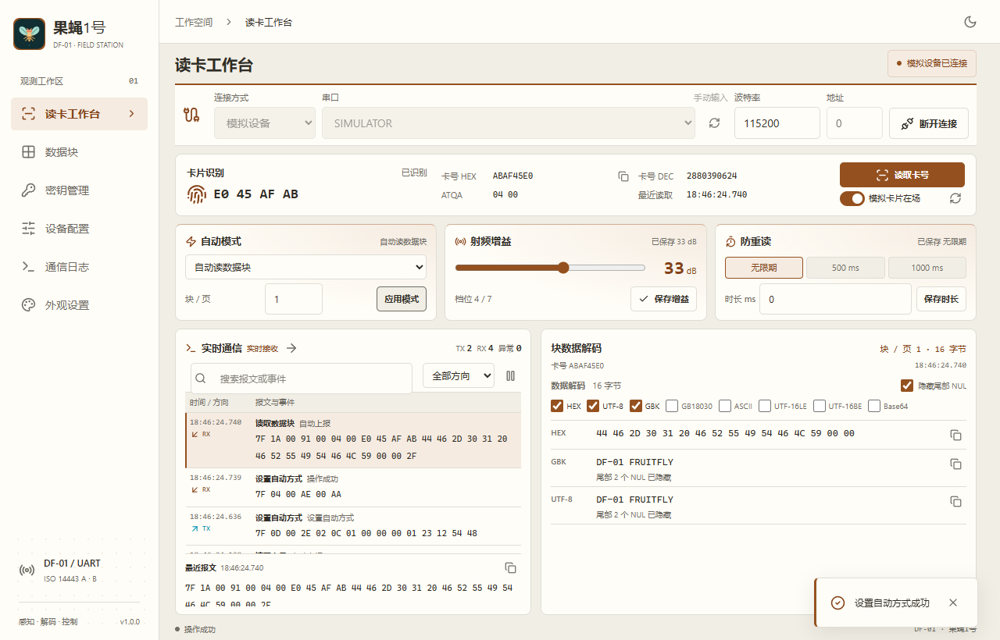
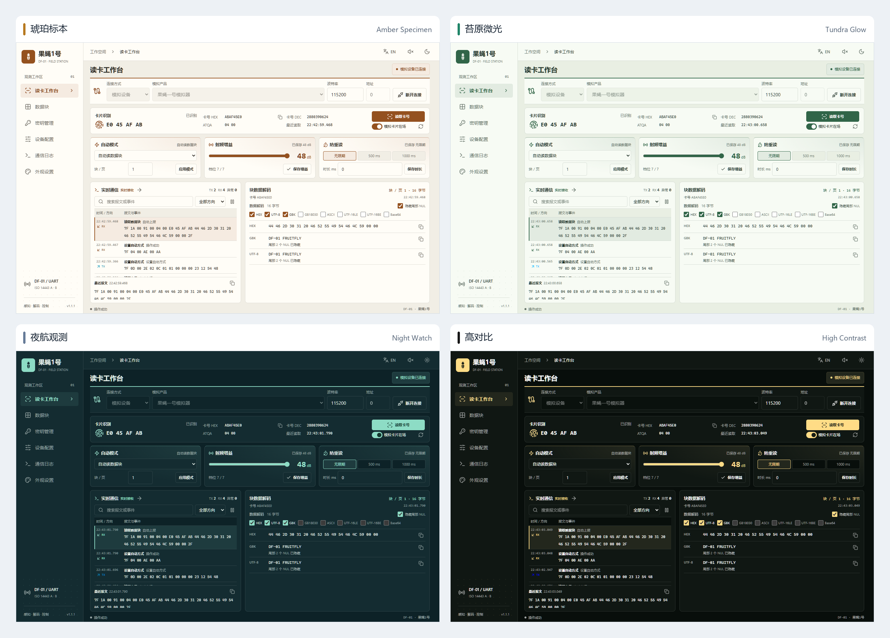

<p align="center">
  <a href="https://github.com/Cans518/df01-studio">
    
  </a>
  &nbsp;&nbsp;&nbsp;&nbsp;
  
</p>

<h1 align="center">果蝇1号 · DF-01</h1>

<p align="center">
  <a href="../README.md"></a>
  <a href="README.en.md"></a>
  <a href="README.fr.md"></a>
</p>

<p align="center">
  DF-01 (Fruitfly No. 1) est une application de bureau open source pour les lecteurs de cartes à liaison série. Elle permet de lire les identifiants, de modifier les blocs mémoire, de gérer les clés d’authentification et de configurer les modules. Développée avec Rust, Tauri 2, React et TypeScript, elle fonctionne hors ligne. L’interface de l’application est disponible en chinois et en anglais.
</p>

<p align="center">
  <a href="https://www.rust-lang.org/"></a>
  <a href="https://tauri.app/"></a>
  <a href="https://react.dev/"></a>
  <a href="https://www.typescriptlang.org/"></a>
</p>

<p align="center">
  <a href="https://github.com/Cans518/df01-studio/issues"></a>
  <a href="../LICENSE"></a>
</p>



## Fonctionnalités

- **Lecture et notifications automatiques** : identifiants hexadécimaux ou décimaux, lecture automatique des UID ou des blocs, temporisation anti-répétition et gain d’antenne.
- **Édition de la mémoire** : 64 blocs S50, lecture de quatre pages Ultralight/NTAG consécutives, plusieurs encodages et import/export JSON.
- **Clés et configuration** : Key A et Key B indépendantes, identifiant du module et relecture de la configuration ; clés et blocs de contrôle masqués dans les journaux.
- **Voix et moteur** : le produit Cockroach dispose d’une page pour la synthèse vocale, le délai de démarrage, la rampe, le rapport cyclique initial et le sens au démarrage.
- **Outils de communication** : filtrage, recherche, décodage, copie des trames et export des journaux.
- **Interface locale** : appareils simulés, quatre thèmes, deux densités d’affichage et commandes audio.

## Aperçu des thèmes

Amber Specimen, Tundra Glow, Night Watch et High Contrast, présentés sur la même interface. Cliquez sur l’image pour l’afficher en taille réelle.

[](screenshots/df01-themes-overview.png)

## Démarrage rapide

Sous Windows, décompressez l’application portable et lancez `df01-studio.exe`. Microsoft Edge WebView2 Runtime est nécessaire. Sous Linux, installez le paquet `.deb` ou lancez l’AppImage ; les prérequis figurent dans le [guide d’utilisation](USER_GUIDE.md).

1. Branchez l’adaptateur série et le lecteur, choisissez le port et saisissez l’identifiant actuel du module (`00` par défaut).
2. Connectez-vous et attendez la lecture de la configuration. La liaison utilise **115200 bit/s, 8N1, sans contrôle de flux**.
3. Présentez une carte et lisez son identifiant ou sa mémoire. Enregistrez séparément le mode automatique, la temporisation anti-répétition et le gain.
4. Sans matériel, sélectionnez un appareil simulé, puis le produit Fruitfly ou Cockroach.

Avant toute écriture, vérifiez le bloc cible et ses 16 octets. Le bloc 0 est en lecture seule ; l’écriture du dernier bloc d’un secteur nécessite une confirmation supplémentaire. L’import JSON charge uniquement l’éditeur. Pour les UID longs, le protocole ne renvoie que les quatre derniers octets.

## Exécution depuis les sources

Installez Node.js **20.19+ (20.x) ou 22.12+**, npm et Rust stable. Sous Windows, ajoutez Visual Studio C++ Build Tools (MSVC), Windows SDK et WebView2. Les dépendances Linux sont indiquées dans le [guide d’utilisation](USER_GUIDE.md).

```sh
git clone https://github.com/Cans518/df01-studio.git
cd df01-studio
npm ci
npm run desktop
```

Pour ouvrir l’interface et le simulateur dans un navigateur :

```sh
npm run dev
```

Ouvrez <http://127.0.0.1:1420/>. L’accès aux ports série physiques nécessite l’application de bureau. Les deux commandes utilisent le même port : lancez-en une seule à la fois.

## Protocole de communication

```text
7F | LEN | ADDR | CMD | PARAMS... | XOR
LEN = 3 + nombre d’octets des paramètres
XOR = LEN ^ ADDR ^ CMD ^ chaque octet des paramètres
```

Chaque octet `7F` après l’en-tête est doublé en `7F 7F`. Calculez la somme de contrôle avant cet échappement. Envoyez les requêtes une par une et attendez chaque réponse ; les notifications automatiques sont émises par le module.

| Opération | Requête → réponse |
| --- | --- |
| Lecture UID / lecture de bloc / écriture de bloc | `10 → 90` / `11 → 91` / `12 → 92` |
| Chargement des clés / identifiant du module | `2B → AB` / `2D → AD` |
| Mode automatique / anti-répétition / gain | `2E → AE` / `2F → AF` / `30 → B0` |
| Lecture de la configuration | `31 → B1` |
| Temporisation de démarrage / rapport cyclique initial / sens au démarrage | `32 → B2` / `33 → B3` / `34 → B4` |

Consultez le [guide du protocole](PROTOCOL.md) et la [référence des commandes](指令和参数表.md) pour les champs, les codes d’état, la compatibilité et les exemples de trames.

## Documentation

La documentation détaillée est en chinois.

- [Guide d’utilisation](USER_GUIDE.md) : environnement, connexion, mémoire, extensions et dépannage.
- [Protocole de communication](PROTOCOL.md) : format des trames, commandes et lecture de configuration.
- [Référence des commandes](指令和参数表.md) : paramètres et réponses de chaque commande.
- [Composants open source](THIRD_PARTY.md) : dépendances et licences.

## Licence

Ce projet est sous [licence Apache 2.0](../LICENSE) (SPDX : `Apache-2.0`). Les mentions d’attribution figurent dans [NOTICE](../NOTICE). Les composants tiers conservent leurs licences respectives ; consultez [THIRD-PARTY-NOTICES.txt](THIRD-PARTY-NOTICES.txt).
